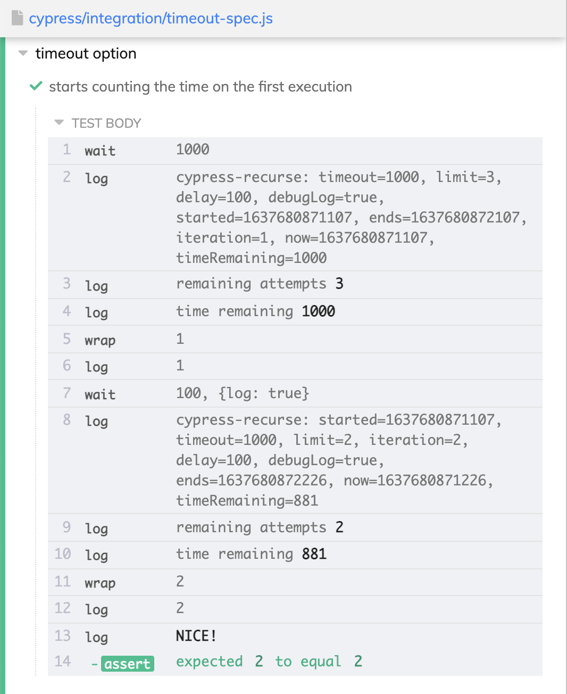

# cypress-recurse

[![ci status][ci image]][ci url] [![renovate-app badge][renovate-badge]][renovate-app]  [](https://dashboard.cypress.io/projects/tbtscx/runs)

> A way to re-run Cypress commands until a predicate function returns true

Jump to: [Options](#options), [Examples](#examples), [Debugging](#debugging), [Videos](#videos).

## Install

```shell
npm i -D cypress-recurse
# or use Yarn
yarn add -D cypress-recurse
```

## Use

### Use a named function

```js
import { recurse } from 'cypress-recurse'

it('gets 7', () => {
  recurse(
    () => cy.task('randomNumber'),
    (n) => n === 7,
  )
})
```

The predicate function should return a boolean OR use assertions to throw errors. If the predicate returns undefined, we assume it passes, see examples in [expect-spec.js](./cypress/e2e/expect-spec.js).

```js
it('works for 4', () => {
  recurse(
    () => cy.wrap(4),
    (x) => {
      expect(x).to.equal(4)
    },
  ).should('equal', 4)
})
```

**Important:** the commands inside the first function cannot fail - otherwise the entire test fails. Thus make them as "passive" as possible, and let the predicate function decide if the entire function needs to be retried or not.

### Use a custom command

Optionally, you can register `cy.recurse` custom command by importing the `cypress-recurse/commands` from your support file or individual specs.

```js
// cypress/support/e2e.js
import 'cypress-recurse/commands'
// your E2E specs
it('works', () => {
  cy.recurse(...)
})
```

Parameters to the `cy.recurse` are the same as for named function: the command function, the predicate, followed by the options. For example, to check if the loader goes away after clicking on a button:

```js
cy.recurse(
  () => {
    cy.get('button').click()
    return cy.get('.loader').should(Cypress._.noop)
  },
  ($el) => $el.length === 0,
  {
    log: false,
    delay: 1000,
  },
)
```

## Yields

The `recurse` function yields the subject of the command function.

```js
import { recurse } from 'cypress-recurse'

it('gets 7', () => {
  recurse(
    () => cy.wrap(7),
    (n) => n === 7,
  ).should('equal', 7)
})
```

## Options

```js
it('gets 7 after 50 iterations or 30 seconds', () => {
  recurse(
    () => cy.task('randomNumber'),
    (n) => n === 7,
    {
      log: true,
      limit: 50, // max number of iterations
      timeout: 30000, // time limit in ms
      delay: 300, // delay before next iteration, ms
    },
  )
})
```

You can see the default options

```js
import { RecurseDefaults } from 'cypress-recurse'
```

### log

The log option can be a boolean flag or your own function. For example to pretty-print each number we could:

```js
recurse(
  () => {...},
  (x) => x === 3,
  {
    log: (k) => cy.log(`k = **${k}**`),
  }
)
```

You can simply print a given string at the successful end of the recursion

```js
recurse(
  () => {...},
  (x) => x === 3,
  {
    log: 'got to 3!',
  }
)
```

If the `log` option is a function, it receives the current value, plus a data object with main iteration properties

```js
log (x, data) {
  // data is like:
  //  value: 3
  //  successful: false|true
  //  iteration: 3
  //  limit: 18
  //  elapsed: 1631
  //  elapsedDuration: "2 seconds"
}
```

See the [log-spec.js](./cypress/e2e/log-spec.js)

### post

If you want to run a few more Cypress commands after the predicate function that are not part of the initial command, use the `post` option. For example, you can start intercepting the network requests after a few iterations:

```js
// from the application's window ping a non-existent URL
const url = 'https://jsonplaceholder.cypress.io/fake-endpoint'
const checkApi = () => cy.window().invoke('fetch', url)

recurse(checkApi, ({ ok }) => ok, {
  post: ({ limit, value }) => {
    // after a few attempts
    // stub the network call and respond
    if (limit === 1) {
      // start intercepting now
      console.log('start intercepting')
      return cy.intercept('GET', url, 'Hello!').as('hello')
    }
    // you can use the value prop to look at the fetch results
  },
})
```

The argument is a single object with `iteration`, `limit`, `value`, `reduced`, `success`, `elapsed`, and `elapsedDuration` properties.

See the [post-spec.js](./cypress/e2e/post-spec.js) and [find-on-page/spec.js](./cypress/e2e/find-on-page/spec.js).

By default, the last value is NOT passed to the `post` callback. You can pass the last value by setting an option

```js
recurse(fn1, predicate, {
  post () {
    ...
  },
  postLastValue: true
})
```

A good combination is `postLastValue: true` and `post({ value, success })` where the `value` is yielded by the first function, and the `success` is the result of checking that value using the predicate function.

**Note:** if you specify both the delay and the `post` options, the delay runs first.

### custom error message

Use the `error` option if you want to add a custom error message when the recursion timed out or the iteration limit has reached the end.

```js
recurse(
  () => {...},
  (x) => x === 3,
  {
    error: 'x never got to 3!',
  }
)
```

### accumulator

Similar to reducing an array, the `reduce` function has an option to accumulate / reduce the values in the given object. The following options work together

- `reduceFrom` is the starting value, like `[]`
- `reduce(acc, item)` receives each value and the current accumulator value
- `reduceLastValue` is false by default, turn it on to call the the `reduce` function with the last value (for which the predicate function has returned true)

TODO: document the above options

If there is a reduced value, it will be passed as the second argument to the predicate function.

See the [reduce-spec.js](./cypress/e2e/reduce-spec.js) for examples.

### yield

If you are accumulating a reduced value, you can yield it instead of the last value. You can even yield both the last and the reduced values.

- `yield: "value"` yields the value that passed the predicate function
- `yield: "reduced"` yields the accumulated value
- `yield: "both"` yields an object with `value` and `reduced` properties

See the [reduce-spec.js](./cypress/e2e/reduce-spec.js) for examples.

### doNotFail

Sometimes you want to retry N times or for M seconds, but not fail the test if the predicate is still false.

```js
recurse(commandFn, predicate, {
  doNotFail: true,
})
```

The yielded value in this case is not guaranteed. You can yield the last value, even if it does not pass the predicate by explicitly asking for it

```js
recurse(
  () => cy.wrap(4),
  (x) => x === 10,
  {
    doNotFail: true,
    yield: 'value',
  },
).should('equal', 4)
```

## each

This plugin also includes the `each` function that iterates over the given subject items. It can optionally stop when the separate predicate function returns true.

```js
import { each } from 'cypress-recurse'
it('iterates until it finds the value 7', () => {
  cy.get('li').then(
    each(
      $li => ..., // do something with the item
      $li => $li.text() === '7' // stop if we see "7"
    )
  )
})
```

The `each` function yields the original or transformed items

```js
const numbers = [1, 2, 3, 4]
cy.wrap(numbers)
  .then(
    each(
      (x) => {
        return 10 + x
      },
      // stop when the value is 13
      (x) => x === 13,
    ),
  )
  .should('deep.equal', [11, 12])
```

See the [each-spec.js](./cypress/e2e/each/each-spec.js) file.

## retry

**Experimental:** this function can change its API at any moment.

If you need retries in your config / plugins code, you can use the included `retry` function.

```js
// your cypress.config.js
import {retry} from 'cypress-recurse/src/retry.js'
// or use require
const {retry} = require('cypress-recurse/src/retry')

async function getData() {
  // your async function that returns data
  // let's say it is a number
  return n
}

e2e: {
  setupNodeEvents(on, config) {
    on('task', {
      async fetchData () {
        // we want to retry "getData" function
        // until it returns a value above 200
        const data = await retry(getData, n => n > 200, {
          limit: 10, // limit calling getData to 10 times
          delay: 100 // delay 100ms between attempts
        })
        return data
      }
    })
  },
},
```

### retry options

```js
retry(fn, predicateFn, options?)
```

Options object can have the following properties

- `limit` the maximum number of attempts to call the given function
- `delay` in milliseconds between calls to `fn`
- `log` log individual calls to `fn` (by default the logging is off). Could be your own function (see below)
- `extract` a custom function that takes the result of the `fn` and returns the value to yield

**Example:** retry until the list is non-empty, then return a property from the first object

```js
const n = retry(fn, (list) => list.length, {
  extract: (list) => list[0].n,
})
```

**Example:** custom log function

```js
// user log function receives these arguments
const log = ({ attempt, limit, value, successful }) => {
  console.log(
    'attempt %d of %d, value %o success: %o',
    attempt,
    limit,
    value,
    successful,
  )
}
retry(fn, predicate, { log })
```

## Examples

- clear and type text into the input field until it has the expected value, see [type-with-retries-spec.js](./cypress/e2e/type-with-retries-spec.js), watch the video [Avoid Flake When Typing Into The Input Elements Using cypress-recurse](https://youtu.be/aYX7OVqp6AE) and read the blog post [Solve Flake In Cypress Typing Into An Input Element
  ](https://glebbahmutov.com/blog/flaky-cy-type/)
- [avoid-while-loops-in-cypress](https://github.com/bahmutov/avoid-while-loops-in-cypress) repo
- [monalego](https://github.com/bahmutov/monalego) repo and [Canvas Visual Testing with Retries](https://glebbahmutov.com/blog/canvas-testing/) blog post, watch [the video](https://www.youtube.com/watch?v=xSK6fe5WD1g)
- [reloading the page until it shows the expected text](./cypress/e2e/reload-page/reload-spec.js) recipe
- [pinging the API endpoint until it responds](https://youtu.be/CU8C6MRP_GU)
- [HTML canvas bar chart testing](https://youtu.be/aeBclf9A92A)
- [Browse Reveal.js Slides Using Cypress and cypress-recurse](https://youtu.be/oq2P1wtIZYY)
- opening each accordion panel until we find a button to click [accordion-spec.js](./cypress/e2e/accordion-spec.js), see video [Use cypress-recurse To Open Accordion Panels Until It Finds A Button To Click](https://youtu.be/s2_467yUF2Y)

## Debugging

Use options `log: true` and `debugLog: true` to print additional information to the Command Log

```js
recurse(getTo(2), (x) => x === 2, {
  timeout: 1000,
  limit: 3,
  delay: 100,
  log: true,
  debugLog: true,
}).should('equal', 2)
```



## Blog posts

📝 Read the following posts

- [Writing Cypress Recurse Function](https://glebbahmutov.com/blog/cypress-recurse/)
- [Crawl Weather Using Cypress](https://glebbahmutov.com/blog/crawl-weather/)
- [Cypress And Twilio](https://glebbahmutov.com/blog/cypress-twilio/)

**Tip:** use [https://cypress.tips/search](https://cypress.tips/search) to search all my testing content

## Videos

I have explained how this module was written in the [following videos](https://www.youtube.com/playlist?list=PLP9o9QNnQuAbegJlN5ZTRxqtUBtKwXOHQ)

1. [Call cy task until it returns an expected value](https://youtu.be/r8_hFwYAo5c)
2. [Reusable recursive function](https://www.youtube.com/watch?v=Q_7-gRQLLMA)
3. [Reusable function with attempts limit](https://www.youtube.com/watch?v=I1oNKD6NNjg)
4. [Recursion function with time limit](https://www.youtube.com/watch?v=Cn8Ubhd49Gw)
5. [Convert recurse to use options object](https://youtu.be/DeMRtTD5p7s)
6. [Add JSDoc types to the options parameter](https://youtu.be/g4qispkHH-o)
7. [Published cypress-recurse NPM package](https://www.youtube.com/watch?v=V82p7qTowXg)

### Courses

🎓 This plugin is covered in multiple lessons in my [Cypress plugins course](https://cypress.tips/courses/cypress-plugins)

- [Lesson i1: Check the list is sorted after some delay](https://cypress.tips/courses/cypress-plugins/lessons/i1)
- [Lesson i2: Call the API until it returns the expected result](https://cypress.tips/courses/cypress-plugins/lessons/i2)
- [Lesson i6: Delete the first todo item until there are no more items](https://cypress.tips/courses/cypress-plugins/lessons/i6)
- [Lesson i7: find row in virtualized table](https://cypress.tips/courses/cypress-plugins/lessons/i7)
- [Lesson i8: Randomly pick a menu](https://cypress.tips/courses/cypress-plugins/lessons/i8)
- [Lesson i10: Recursively delete items while the page reloads](https://cypress.tips/courses/cypress-plugins/lessons/i10)
- [Lesson i11: Repeatedly check the task status](https://cypress.tips/courses/cypress-plugins/lessons/i11)
- [Lesson n3: Pagination using cypress-recurse](https://cypress.tips/courses/cypress-plugins/lessons/n3)
- [Lesson o2: Periodically check LowDB data until the record is found](https://cypress.tips/courses/cypress-plugins/lessons/o2)
- [Lesson o3: Retry checking LowDB inside the task code](https://cypress.tips/courses/cypress-plugins/lessons/o3)

🎓 This plugin was used in my course [Cypress Network Testing Exercises](https://cypress.tips/courses/network-testing)

- [Bonus 2: Collect all fruits using cypress-recurse plugin](https://cypress.tips/courses/network-testing/lessons/bonus02)
- [Bonus 27: Use cypress-recurse to ping the endpoint until it succeeds](https://cypress.tips/courses/network-testing/lessons/bonus27)
- [Bonus 33: Query APIs to check the 3rd party services](https://cypress.tips/courses/network-testing/lessons/bonus33)
- [Bonus 34: Print messages to the terminal when retrying cy.request calls](https://cypress.tips/courses/network-testing/lessons/bonus34)
- [Bonus 38: Check all intercepted network calls using cypress-recurse plugin](https://cypress.tips/courses/network-testing/lessons/bonus38)
- [Bonus 63: Retry calling an API endpoint and log each attempt](https://cypress.tips/courses/network-testing/lessons/bonus63)

### Bonus videos

1. [use cypress-recurse to find the downloaded file](https://www.youtube.com/watch?v=Ty5ltRdgr5M)
2. [canvas visual testing](https://www.youtube.com/watch?v=xSK6fe5WD1g)
3. [wait for API to respond](https://www.youtube.com/watch?v=CU8C6MRP_GU)
4. [get to the last page](https://youtu.be/6-xHHtAzNtk) by clicking the "Next" button
5. [Use cypress-recurse To Scroll The Page Until It Loads The Text We Are Looking For](https://youtu.be/KHn7647xOz8)
6. [Use cypress-recurse Plugin To Confirm The Table Gets Sorted Eventually](https://youtu.be/Ke5Pf6IISn8)
7. [Use cypress-recurse To Ping The Site Before Visiting It](https://youtu.be/8rtBk9MBjXA)
8. [Use cypress-recurse To Click The Back Button Until It No Longer Exists](https://youtu.be/G-4HbUuUqIM)
9. [Reload The Page Until We See 7 Plus Check The Numbers Before That](https://youtu.be/KHJkRp_rRYg)
10. [Click On The Button Until It Becomes Disabled](https://youtu.be/u2JUQY2TE3A)
11. [Stub cy.request Command Using cy.stub And Use cypress-recurse Example](https://youtu.be/rFhTejdPGAM)
12. [Use cypress-recurse To Open Accordion Panels Until It Finds A Button To Click](https://youtu.be/s2_467yUF2Y)
13. [Access The Response Text Yielded By The Plugin cypress-response](https://youtu.be/MRelgoMg230)
14. [Cypress Asynchronous Unit Tests Using Sinon.js And Chai](https://youtu.be/2rn3fsR8xp0)
15. [Go To The Previous Page While Possible Using cypress-recurse](https://youtu.be/B_oOHtuUJwc)

## Small print

Author: Gleb Bahmutov &lt;gleb.bahmutov@gmail.com&gt; &copy; 2021

- [@bahmutov](https://twitter.com/bahmutov)
- [glebbahmutov.com](https://glebbahmutov.com)
- [blog](https://glebbahmutov.com/blog)
- [videos](https://www.youtube.com/glebbahmutov)
- [presentations](https://slides.com/bahmutov)
- [cypress.tips](https://cypress.tips)

License: MIT - do anything with the code, but don't blame me if it does not work.

Support: if you find any problems with this module, email / tweet /
[open issue](https://github.com/bahmutov/cypress-recurse/issues) on Github

## MIT License

Copyright (c) 2020 Gleb Bahmutov &lt;gleb.bahmutov@gmail.com&gt;

Permission is hereby granted, free of charge, to any person
obtaining a copy of this software and associated documentation
files (the "Software"), to deal in the Software without
restriction, including without limitation the rights to use,
copy, modify, merge, publish, distribute, sublicense, and/or sell
copies of the Software, and to permit persons to whom the
Software is furnished to do so, subject to the following
conditions:

The above copyright notice and this permission notice shall be
included in all copies or substantial portions of the Software.

THE SOFTWARE IS PROVIDED "AS IS", WITHOUT WARRANTY OF ANY KIND,
EXPRESS OR IMPLIED, INCLUDING BUT NOT LIMITED TO THE WARRANTIES
OF MERCHANTABILITY, FITNESS FOR A PARTICULAR PURPOSE AND
NONINFRINGEMENT. IN NO EVENT SHALL THE AUTHORS OR COPYRIGHT
HOLDERS BE LIABLE FOR ANY CLAIM, DAMAGES OR OTHER LIABILITY,
WHETHER IN AN ACTION OF CONTRACT, TORT OR OTHERWISE, ARISING
FROM, OUT OF OR IN CONNECTION WITH THE SOFTWARE OR THE USE OR
OTHER DEALINGS IN THE SOFTWARE.

[ci image]: https://github.com/bahmutov/cypress-recurse/workflows/ci/badge.svg?branch=main
[ci url]: https://github.com/bahmutov/cypress-recurse/actions
[renovate-badge]: https://img.shields.io/badge/renovate-app-blue.svg
[renovate-app]: https://renovateapp.com/
